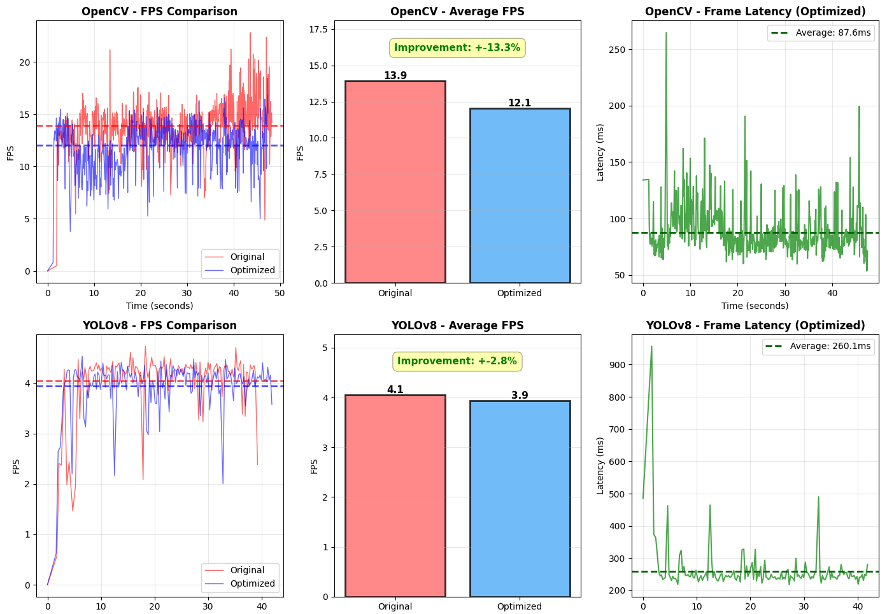

# Tello Drone Visual Tracking Project

> **ArUco 마커 기반 단안 비주얼 SLAM을 향한 준비 단계**  
> DJI Tello 드론을 활용한 실시간 객체 추적 및 성능 최적화 실험

---

## 📌 프로젝트 개요

이 프로젝트는 **ArUco 마커 기반 단안 비주얼 SLAM** 구현을 최종 목표로 하며, 현재는 OpenCV와 YOLOv8n을 활용한 실시간 얼굴 추적 시스템을 통해 기초 기술을 검증하는 단계입니다.

### 최종 목표
- **카메라 캘리브레이션**을 통한 정확한 3D 위치 추정
- **ArUco 마커 기반 단안 비주얼 SLAM** 구현
- 실내 환경에서의 자율 주행 및 3D 공간 매핑

---

## 🚁 현재 단계: 실시간 객체 추적 시스템

### 구현된 기능
1. **OpenCV Haar Cascade 기반 얼굴 추적** (`tello_face_opencv.py`)
2. **YOLOv8n 기반 사람 인식 및 추적** (`tello_face_yolov8.py`)
3. **Producer-Consumer 패턴 적용** (성능 최적화 시도)
4. **PID 제어** (P-제어 중심, D-제어 준비)
5. **성능 측정 시스템** (FPS, 비동기 로깅)
6. **비디오 저장 기능** (처리된 프레임 자동 저장)

### 주요 발견 사항

#### ✅ 인식 성능 비교
- **OpenCV Haar Cascade**: 얼굴 인식률이 낮음 (조명, 각도에 민감)
- **YOLOv8n**: 안정적인 사람 인식 성능 (다양한 환경에서 robust)

#### ⚠️ Producer-Consumer 패턴의 한계
초기에는 영상 처리 지연을 해결하기 위해 **Producer-Consumer 패턴**을 적용했으나, 실제 측정 결과 **성능 개선 효과가 미미**했습니다.

**원인**: `djitellopy` 라이브러리 내부에서 이미 프레임 버퍼링과 최적화가 적용되어 있어, 외부에서 추가 스레딩을 적용해도 큰 효과가 없었습니다.



위 그래프에서 볼 수 있듯이, Producer-Consumer 패턴 적용 전후의 FPS 차이는 거의 없습니다. 이는 Tello SDK의 내부 최적화가 이미 충분히 효율적임을 의미합니다.

---

## 🛠️ 개발 환경

### Hardware
- **DJI Tello** (Ryze Tech)
  - 단안 카메라 (720p, 30fps)
  - WiFi 기반 영상 스트리밍

### Software
- **Python 3.x**
- **주요 라이브러리**:
  - `djitellopy` - Tello 드론 제어
  - `opencv-contrib-python` - 영상 처리 및 ArUco 마커 검출
  - `ultralytics` - YOLOv8 객체 인식
  - `numpy` - 수치 연산
  - `pandas`, `matplotlib` - 성능 분석 및 시각화
  - `fpdf` - 캘리브레이션용 체스보드 생성

---

## 📁 프로젝트 구조

```
tello_drone_project/
├── tello_face_opencv.py              # OpenCV 기반 얼굴 추적
├── tello_face_yolov8.py              # YOLOv8n 기반 사람 추적
├── product_consumer_pattern_opencv.py # Producer-Consumer 패턴 (OpenCV)
├── product_consumer_pattern_yolov8.py # Producer-Consumer 패턴 (YOLOv8)
├── analyze_performance.py             # 성능 분석 및 그래프 생성
├── calibration/
│   ├── generate_chessboard_pdf.py    # 캘리브레이션용 체스보드 생성
│   ├── calibration_capture.py        # 캘리브레이션 이미지 캡처
│   └── calibration_run.py            # 카메라 캘리브레이션 실행
├── logs/                             # 성능 측정 CSV 로그 저장
├── videos/                           # 처리된 영상 저장
└── requirements.txt                  # Python 패키지 의존성
```

---

## 🚀 향후 계획

### Phase 1: 카메라 캘리브레이션
- [ ] 체스보드 패턴을 활용한 카메라 내부 파라미터 추출
- [ ] 렌즈 왜곡 보정 (Distortion Correction)
- [ ] 정확한 3D 좌표 변환을 위한 기반 마련

### Phase 2: ArUco 마커 검출 및 Pose Estimation
- [ ] `cv2.aruco` 모듈을 활용한 마커 검출
- [ ] `solvePnP`를 통한 3D 위치 및 자세 추정
- [ ] 단일 마커 기반 드론 위치 추적

### Phase 3: 단안 비주얼 SLAM
- [ ] 다중 마커 동시 처리 및 앵커 선정 알고리즘
- [ ] 마커 기반 위치 보정 및 누적 오차 감소
- [ ] 3D 공간 지도 생성 (Sparse Map)
- [ ] 자율 탐색 및 경로 계획 알고리즘 구현

---

## 📊 성능 측정 시스템

### 구현된 기능
- **FPS 측정**: 실시간 처리 속도 모니터링
- **비동기 로깅**: 메인 루프에 영향 없는 백그라운드 CSV 저장
- **비디오 저장**: 처리된 프레임 자동 녹화 (XVID 코덱)
- **성능 분석 도구**: `analyze_performance.py`로 자동 그래프 생성

### 안전 기능
- **Pre-flight 모델 검증**: 이륙 전 AI 모델 로드 및 초기화 확인
- **에러 핸들링**: 모델 로드 실패 시 안전한 프로그램 종료
- **비상 착륙**: `q` 키 또는 KeyboardInterrupt 시 자동 착륙

---

## 📝 주요 학습 내용

1. **OpenCV vs YOLOv8**: 실시간 추적에서는 YOLOv8n이 더 robust한 성능 제공
2. **Producer-Consumer 패턴의 한계**: Tello SDK 내부 최적화로 인해 추가 스레딩 효과 미미
3. **이미지 사이즈 최적화**: 해상도 축소 (`imgsz=320`)로 YOLOv8 추론 속도 2-3배 향상
4. **비동기 I/O**: LogWriter 및 VideoWriter 스레드로 메인 루프 성능 보호

---

## 🔗 참고 자료

- [DJI Tello SDK Documentation](https://dl-cdn.ryzerobotics.com/downloads/Tello/Tello%20SDK%202.0%20User%20Guide.pdf)
- [OpenCV ArUco Module](https://docs.opencv.org/4.x/d5/dae/tutorial_aruco_detection.html)
- [YOLOv8 Documentation](https://docs.ultralytics.com/)

---